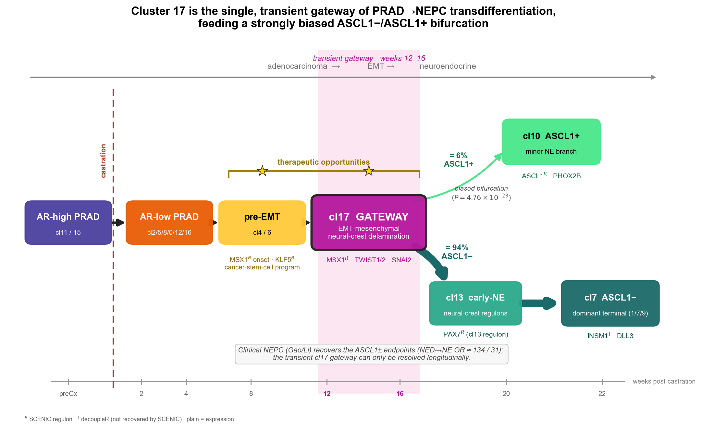

# LTL331 NEPC scRNA-seq

<p align="center">
  
</p>

Longitudinal single-cell RNA-seq of neuroendocrine transdifferentiation (NEtD) in
the LTL331 patient-derived xenograft (51,726 cells, 8 timepoints, pre-castration →
NEPC), with WES/CNV, trajectory, RNA velocity, fate mapping, regulon, and clinical
cross-dataset analyses. Code for *Genome Medicine* (under revision).

## Key findings

- **A single obligate gateway.** Every inferred PRAD→NEPC path funnels through one
  transient EMT-mesenchymal state (cluster 17; ~0.25% of cells, weeks 12 to 16),
  which sits below the resolution of any cross-sectional patient biopsy.
- **A biased fate decision.** Beyond the gateway the lineage bifurcates with strong
  bias toward the ASCL1− fate (CellRank2 fate probability ≈ 0.94 versus ≈ 0.06;
  P = 4.76 × 10⁻²³), diverging from the canonical ASCL1/PHOX2B route.
- **A conserved program, resolved in time.** The transition re-engages early
  neural-crest regulators in developmental order (MSX1 at the gateway), and the
  neuroendocrine endpoints replicate in the Gao and Li patient cohorts by
  embedding-free cross-cohort validation (MetaNeighbor, reference-projection label
  transfer, NED-enrichment odds ratios ≈ 134 and 31).

## Reproduce

1. **Environment** (uv, Python 3.11) — from the project root:
   ```
   uv venv .venv --python 3.11
   source .venv/bin/activate
   uv pip compile env/requirements.in -o env/requirements.txt   # if requirements.txt absent
   uv pip install -r env/requirements.txt                        # locked versions
   ```
   `env/README.md` documents the canonical vs. slimmer local-exploration env and
   how versions were captured.
2. **Data** — see `DATA_AVAILABILITY.md` (figshare DOIs for processed objects; GEO
   GSE297328 + reviewer token for raw data).
3. **Parameters** — all thresholds/seeds/versions live in `config/params.yaml`
   (human-readable: `docs/methods_parameter_table.md`).
4. **Figures** — `FIGURES.md` maps every main and supplementary panel to its
   script. Example:
   ```
   python scripts/python/cellrank_bifurcation.py \
       --h5ad <figshare_velocity.h5ad> --cluster-key clusters \
       --intermediate 17 --ascl1-pos 10 --ascl1-neg 7
   ```

## Layout

```
scripts/python              analyses (see FIGURES.md for figure mapping)
config/params.yaml          all parameters
docs/                       methods parameter table
env/                        exact tool versions (uv / pip-tools; requirements.in → .txt)
data/README.md             data sources (files hosted on figshare/GEO)
review/                     revision planning + response material
```

## Reproducibility

This repository is the manuscript's code artifact. A workflow (Snakemake/Nextflow) 
wrapping these scripts is planned; until then, `FIGURES.md` + `config/params.yaml` 
provide the documented "link to code" the reviewer requested.

## Citation

If you use this code or the derived data, please cite the article:

> Sar F. *et al.* Longitudinal single-cell RNA sequencing of a neuroendocrine
> transdifferentiation model reveals transcriptional reprogramming in
> treatment-induced neuroendocrine prostate cancer. *Genome Medicine* (in revision).
> DOI: to be added on acceptance.

Machine-readable metadata (for GitHub's "Cite this repository") is in
[`CITATION.cff`](CITATION.cff). Code and processed data are released under the
repository [`LICENSE`](LICENSE).
