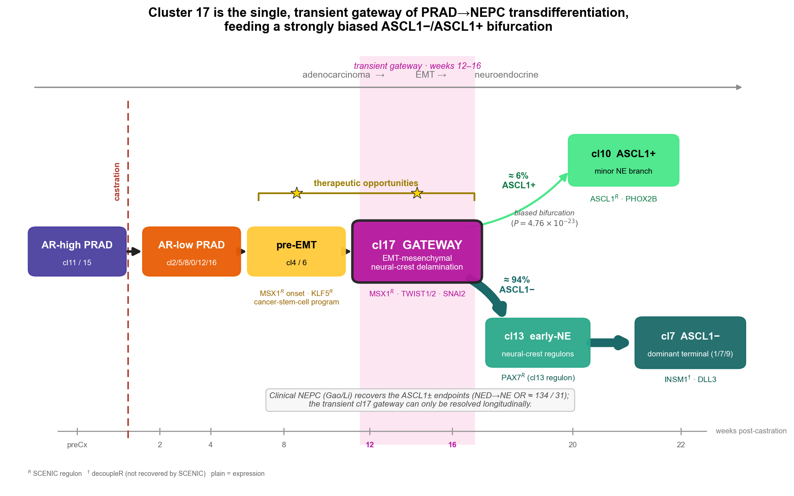

# LTL331 NEPC scRNA-seq

<p align="center">
  
</p>

Longitudinal single-cell RNA-seq of neuroendocrine transdifferentiation (NEtD) in the
LTL331 patient-derived xenograft (51,726 cells, 8 timepoints, from pre-castration
adenocarcinoma to relapsed neuroendocrine prostate cancer), with whole-exome and
copy-number, trajectory, RNA velocity, fate-mapping, regulon and clinical
cross-cohort analyses. Code accompanying the article in *Genome Medicine* (accepted).

## What is new

Patient single-cell studies of neuroendocrine prostate cancer (NEPC) capture established
tumors at a single timepoint, and bulk profiling of LTL331 follows the transition over
time but averages across cells. This study combines both: single-cell resolution across
a reproducible castration time course in the same patient-derived model.

| | Patient scRNA-seq (e.g., [Dong et al. 2020](https://doi.org/10.1038/s42003-020-01476-1); [Wang et al. 2022](https://doi.org/10.1016/j.isci.2022.104576)) | Bulk LTL331 time course ([Akamatsu et al. 2015](https://doi.org/10.1016/j.celrep.2015.07.012)) | Mouse / in vitro NEPC models | **This study** |
|---|---|---|---|---|
| Human tumor | ✓ | ✓ (PDX) | ✗ | ✓ (PDX) |
| Time course | ✗ (single timepoint) | ✓ | ✓ | ✓ (8 timepoints) |
| Single-cell resolution | ✓ | ✗ | ✓ | ✓ |
| Transient transition state resolved | ✗ | ✗ | varies | ✓ (~0.25% of cells) |
| Fate direction quantified | ✗ | ✗ | ✗ (states described) | ✓ (≈0.94 vs ≈0.06) |

What this adds: an obligate EMT-mesenchymal gateway between adenocarcinoma and
neuroendocrine states, the ordered re-engagement of early neural-crest regulators
(MSX1) at that gateway, and a strongly biased, tuft-negative *ASCL1*− fate.

## Key findings

- **A single obligate gateway.** Every inferred PRAD-to-NEPC path funnels through one
  transient EMT-mesenchymal state (cluster 17; ~0.25% of cells, peaking at weeks 12–16),
  which falls below the resolution of cross-sectional patient biopsies.
- **A biased fate decision.** Beyond the gateway the lineage bifurcates with strong bias
  toward a tuft-negative *ASCL1*− fate (CellRank 2 fate probability ≈0.94 versus ≈0.06;
  *P* = 4.76 × 10⁻²³), diverging from the canonical ASCL1/PHOX2B route.
- **A developmental program, resolved in time.** The transition re-engages early
  neural-crest regulators in developmental order (MSX1 at the gateway), and the
  adenocarcinoma and *ASCL1*+ neuroendocrine states replicate in two clinical
  single-cell cohorts by embedding-free cross-cohort comparison (MetaNeighbor-style
  AUROC, reference-projection label transfer; neuroendocrine-differentiation odds
  ratios 134.6 and 31.4).

## How this relates to current debates

- **Basal versus luminal origin.** Castration-tolerant basal and progenitor populations
  have been proposed as sources of lineage plasticity, in normal prostate
  ([Karthaus et al. 2020](https://doi.org/10.1126/science.aay0267)) and as a basal
  origin of neuroendocrine–tuft plasticity in small cell lung cancer
  ([Ireland et al. 2025](https://doi.org/10.1038/s41586-025-09503-z)). In LTL331, the transition instead proceeds from AR-low luminal
  adenocarcinoma states through an EMT-mesenchymal gateway that lacks basal
  cytokeratins and shows only rare, focal p63 staining, consistent with luminal
  reprogramming. The two routes are not mutually exclusive.
- **ASCL1 versus tuft fates.** Recent models describe a neuroendocrine split involving
  tuft-like lineages: *ASCL1*+ and POU2F3+ states in an *Rb1*-loss/*MYCN* mouse model
  ([Brady et al. 2021](https://doi.org/10.1038/s41467-021-23780-y)), and *ASCL1*− and
  ASCL2-defined lineages in a human transformation model
  ([Chen et al. 2023](https://doi.org/10.1016/j.ccell.2023.10.009)). Here the dominant fate (~94%) is *ASCL1*-negative
  and tuft-negative (*POU2F3* in 0.7% of cells), and the canonical *ASCL1*+ route is a
  minor branch, suggesting a distinct axis of neuroendocrine fate in this human model.

## Approach: established tools, not new methods

This repository introduces **no new algorithm**. We used widely adopted tools with
default or literature-standard settings, so that results can be compared directly with
prior studies of neuroendocrine transdifferentiation.

| Question | Tools |
|---|---|
| Processing, QC and clustering | [Cell Ranger](https://www.10xgenomics.com/support/software/cell-ranger), [Seurat](https://satijalab.org/seurat/), [DoubletFinder](https://github.com/chris-mcginnis-ucsf/DoubletFinder) |
| Copy number and clonality | [inferCNV](https://github.com/broadinstitute/inferCNV); WES with [BWA](https://github.com/lh3/bwa), [Picard](https://broadinstitute.github.io/picard/) and [Nexus Copy Number](https://bionano.com/nexus-copy-number-software/) |
| Trajectory and fate | [PAGA](https://scanpy.readthedocs.io/) (Scanpy), [velocyto](http://velocyto.org/), [scVelo](https://scvelo.readthedocs.io/), [CellRank 2](https://cellrank.readthedocs.io/) |
| Regulators | [pySCENIC](https://github.com/aertslab/pySCENIC), [decoupler](https://decoupler.readthedocs.io/) (Python; [CollecTRI](https://github.com/saezlab/CollecTRI) prior), [ChEA3](https://maayanlab.cloud/chea3/), [HOMER](http://homer.ucsd.edu/homer/) |
| Clinical comparison | [Harmony](https://github.com/immunogenomics/harmony), [MetaNeighbor](https://github.com/gillislab/MetaNeighbor)-style AUROC, reference-projection label transfer, [cNMF](https://github.com/dylkot/cNMF) |

The only custom code is analysis glue: the obligate-gateway (cut-vertex) test, a
MetaNeighbor-style AUROC implementation, the reference-projection label transfer, and
plotting. All parameters, seeds and software versions are in `config/params.yaml`
(human-readable: `docs/methods_parameter_table.md`).

## Scope and limitations

- A single patient-derived model; generality needs testing in other models and patients.
- Regulators are inferred from expression and regulon activity, not functionally perturbed.
- Chromatin evidence comes from independent public datasets and is descriptive.
- The transient gateway is below the resolution of current clinical single-cell cohorts.

## Reproduce

1. **Environment** (uv, Python 3.11), from the project root:
   ```
   uv sync
   source .venv/bin/activate
   ```
   `uv sync` reads the committed `pyproject.toml` and `uv.lock` and builds a consistent,
   cross-platform environment (Linux and macOS, including Apple Silicon).
   `env/README.md` documents this environment and a legacy pip fallback
   (`env/requirements.txt`).
2. **Data**: see `DATA_AVAILABILITY.md` (processed objects and raw data in GEO
   GSE297328, publicly available).
3. **Parameters**: all thresholds, seeds and versions are in `config/params.yaml`
   (human-readable: `docs/methods_parameter_table.md`).
4. **Figures**: `FIGURES.md` maps every main and supplementary panel to its script, and
   `RUN.md` gives run instructions. Example:
   ```
   python scripts/python/cellrank_bifurcation.py \
       --h5ad data/objects/ltl331_velocity.h5ad --cluster-key clusters \
       --intermediate 17 --ascl1-pos 10 --ascl1-neg 7
   ```

## Layout

```
scripts/python              analyses (see FIGURES.md for figure mapping)
config/params.yaml          all parameters
docs/                       methods parameter table
pyproject.toml, uv.lock     pinned environment (`uv sync`)
env/                        environment notes and legacy pip fallback
data/README.md              data sources (files hosted on GEO GSE297328)
figures/                    graphical abstract
```

## Reproducibility

`FIGURES.md` and `config/params.yaml` document how every figure is produced. A workflow
wrapper (Snakemake/Nextflow) around these scripts is planned.

## Citation

If you use this code or the derived data, please cite the article:

> Sar F. *et al.* Longitudinal single-cell RNA sequencing of a neuroendocrine
> transdifferentiation model reveals transcriptional reprogramming in
> treatment-induced neuroendocrine prostate cancer. *Genome Medicine* (accepted).
> DOI: to be added on publication.

Machine-readable metadata (for GitHub's "Cite this repository") is in
[`CITATION.cff`](CITATION.cff). Code and processed data are released under the
repository [`LICENSE`](LICENSE).
